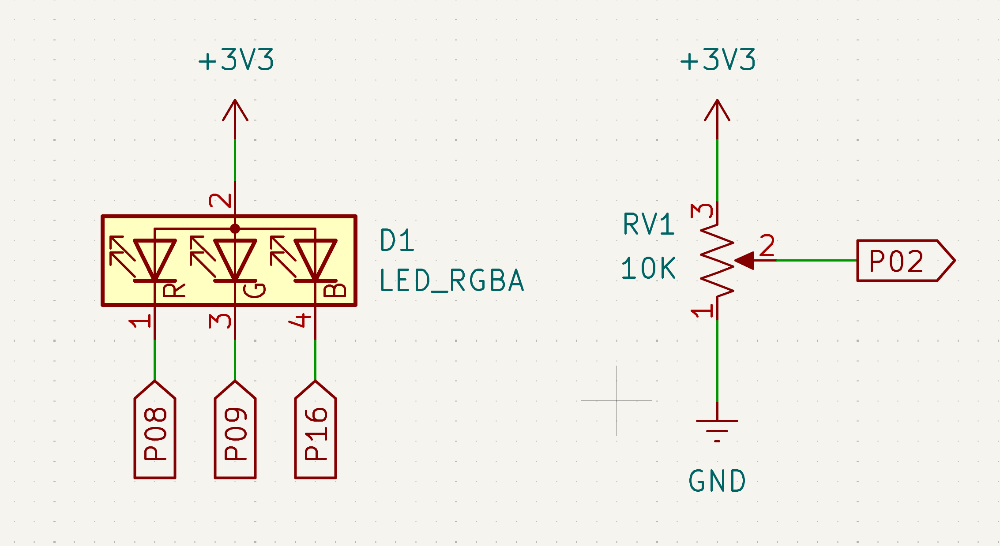

# HSV

Copyright (c) 2026 Sean Springer

Use the MB2, edge connector, and 10k potentiometer to control the HSV of a RGB LED

<video controls width="100%" height=500px>
  <source src="video/VIDEO.mp4" type="video/mp4">
  Your browser does not support the video tag.
</video>

## What It Does

RGB LEDs are great but how can these 3 colors be controlled to generate the full spectrum of the [rainbow](https://en.wikipedia.org/wiki/Rainbow)?  
This crate utilizes a custom timer-based pulse width modulation ([PWM](https://en.wikipedia.org/wiki/Pulse-width_modulation)) to toggle the red, green, and blue pins  
of the RGB LED to give the illusion of the full-spectrum of colors. The Hue, Saturation, and Value ([HSV](https://en.wikipedia.org/wiki/HSL_and_HSV)) parameters  
can be selected by pressing the A/B buttons on the MB2 and their associated values can be adjusted using the potentiometer (see video).

## How It Works

Each PWM cycle occurs in increments of 100usecs with 100 total frames required to generate a single color (10msec per color). This  
10Hz color rate is faster than the human eye can distguish and so gives the illusion of colors other than red, green, and blue.  
To accomplish this, an MB2 timer peripheral is dedicated to the RGB PWM cycle where each color (consider color now in the [RGB](https://en.wikipedia.org/wiki/RGB_color_model) color space)  
pin is turned on for a percentage of the total color duration (10msec).

For example, consider the rgb code 204,51,128 (magenta). This rgb code can be converted to a percentage scale (range [0,1]) by dividing  
each value by 255: rgb(0.8, 0.2, 0.5). Therefore, to produce this color via PWM of the RGB pins of the LED we must leave the red pin on  
for 80% of the total duration, green on for 20%, blue on for 50%, and all pins off for the remaining 20%. Because each color frame last  
10 msecs, the red pin duration would be 8msec, green pin duration 2msec, blue pin for 5msec, and off for 2 msec.

A potentiometer is used to control the color settings using the HSV color model. The voltage out of the pot is sampled using the MB2 ADC.  
This voltage is averaged over the 10msec update interval to produce a final scaled percentage [0,1]. The MB2 A/B buttons can be used to  
change whether the pot adjustments will effect the hue, saturation, or value of the HSV color model and the currently selected setting is  
displayed on the MB2 5x5 LED matrix.

## Physical Setup

The 3.3V MB2 power supply is used to provide LED and pot power. The following wiring setup is assumed by this code:

1. Red LED Pin   -> MB2 P0_10 Pin (e08)
2. Green LED Pin -> MB2 P0_09 Pin (e09)
3. Blue LED Pin  -> MB2 P1_02 Pin (e16)
4. Pot Voltage   -> MB2 P0_04 Pin (e02)

Here is a schematic representation of above, using the microbit GPIO edge board connector terminal names:



## Build and Run

Assuming you have an attached MB2 with necessary permissions (see [Rust MB2 Discovery Book](https://docs.rust-embedded.org/discovery-mb2/))  
then this program can be `flashed` onto the MB2 nRF52820 using

```bash
cargo embed --release
```

## Sources

1. [Rust MB2 Discovery Book](https://docs.rust-embedded.org/discovery-mb2/)
2. [Rustdoc](https://doc.rust-lang.org/rustdoc/what-is-rustdoc.html)
3. Claude Sonnet 4.5 (free version)
4. nRF52833 Product Specification v1.6
5. MicroBit v2.21 Schematic
6. [Microbit Hal Docs](https://docs.rs/microbit/latest/microbit/hal/index.html)
7. [Microbit V2 Crate](https://docs.rs/microbit-v2/latest/microbit/)
8. [HSV](https://en.wikipedia.org/wiki/HSL_and_HSV)

## License

This program is licensed under the "MIT License". Please  
see the file `LICENSE` in the source distribution of this  
software for license terms.
